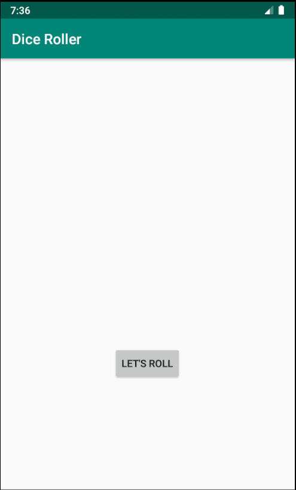
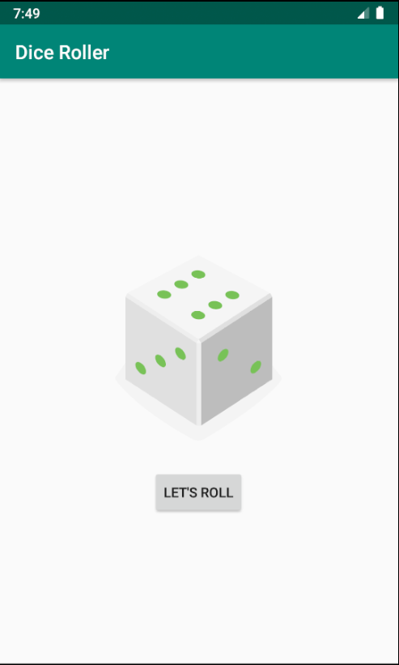

Created an android app that allows you to roll a dice.

Instructions on how to download/run:

Make sure that you have Android Studio downloaded, and click on the Clone or Download button. 

Then Download the zipped files, and import the settings into a new Android Studio Project.

Make sure that you have the proper files installed that are in the Gradle Scripts.

                                
